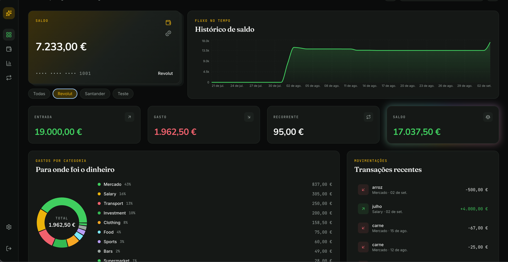

# Money Flow

Personal finance tracker with two interfaces: a Telegram Bot for quick daily expense/income logging and a React Dashboard for visualization and analytics.

Built as a real tool I use daily to manage finances across currencies (EUR/BRL).



## Architecture

```
                    ┌──────────────────────┐
                    │     Traefik          │
                    │  (reverse proxy)     │
                    │  TLS + WAF + Rate    │
                    └─────┬──────┬─────────┘
                          │      │
              /api/*      │      │     /*
                          │      │
                 ┌────────▼──┐ ┌─▼──────────┐
                 │  Spring   │ │   React    │
                 │  Boot API │ │  Dashboard │
                 │  (8080)   │ │  (nginx)   │
                 └─────┬─────┘ └────────────┘
                       │
                 ┌─────▼─────┐
                 │ PostgreSQL│
                 │    17     │
                 └───────────┘

       ┌────────────┐
       │  Telegram   │──webhook──▶ POST /api/integration/telegram-webhook
       │  Bot API    │
       └────────────┘
```

## Tech Stack

### Backend
- Java 25 + Spring Boot 3
- Spring Security with JWT (stateless sessions)
- Spring Data JPA (Hibernate) with `ddl-auto=validate`, schema managed manually via SQL
- PostgreSQL 17 with custom ENUMs (`frequency`, `operation`) and `NUMERIC` for monetary values

### Frontend
- React + TypeScript + Vite
- Recharts for balance history, income vs expense charts, category donut
- Tailwind CSS

### Infrastructure
- Docker with multi-stage builds for both backend (Temurin JDK/JRE) and frontend (Node + nginx)
- Docker Compose orchestrating backend, frontend, and PostgreSQL
- Traefik v3 as reverse proxy with automatic Let's Encrypt TLS, Coraza WAF (OWASP CRS), rate limiting
- Self-hosted on VPS

## Database Schema

5 tables with PostgreSQL ENUMs for fixed domains and foreign keys for user-created entities:

| Table | Purpose |
|-------|---------|
| `owner` | User accounts with email/password auth and optional Telegram linking |
| `account` | Financial accounts (checking, savings, etc.) with running balance |
| `category` | Transaction categories (global in v1) |
| `recurring_payment` | Templates for recurring charges, amount can change over time |
| `transactions` | Immutable financial event records |

Key design decisions:
- `NUMERIC` for all monetary values, `BigDecimal` in Java. Never floating point for money
- `recurring_payment` and `transactions` both have `amount`. Not duplication. The template can change (e.g. gym price increases), the recorded event doesn't
- `recurring_payment_id` in transactions is nullable. Ad-hoc transactions from Telegram don't come from recurring rules
- Schema is version-controlled in `creation.sql` and validated by Hibernate at startup

## Telegram Bot

Positional command interface for quick logging on the go:

| Command | Example | Description |
|---------|---------|-------------|
| `/gasto` | `/gasto mercado carne 25,90 1` | Log an expense |
| `/entrada` | `/entrada salario salario 3500 1` | Log income |
| `/categorias` | `/categorias` | List all categories |
| `/add-categoria` | `/add-categoria transporte` | Create a category |
| `/add-conta` | `/add-conta poupanca 1000` | Create an account |
| `/contas` | `/contas` | List accounts with balances |

Values use Brazilian/Portuguese format: comma as decimal separator (`25,90`), period as thousands separator (`1.000,50`).

## Dashboard

Web interface for financial analytics:

- Account switcher with individual balances
- KPI cards for total spent, total income, recurring payments
- Category breakdown with donut chart
- Balance history as daily line chart
- Income vs Expense monthly comparison bar chart
- Recent transactions with filterable date range picker
- Currency display selector (BRL / EUR / USD)

## API Endpoints

### Auth
| Method | Endpoint | Description |
|--------|----------|-------------|
| POST | `/api/auth/login` | Authenticate and receive JWT |

### Transactions
| Method | Endpoint | Description |
|--------|----------|-------------|
| GET | `/api/transactions` | List transactions by date range |
| GET | `/api/transactions/total-spent-by-category` | Total spent in a category |
| GET | `/api/transactions/total-spent-by-time` | Total expenses in period |
| GET | `/api/transactions/total-income-by-time` | Total income in period |
| GET | `/api/transactions/total-recurring-by-time` | Total recurring in period |
| GET | `/api/transactions/total-spent-ranked-by-category` | Spending ranked by category |
| GET | `/api/transactions/income-expense-monthly` | Monthly income vs expense |
| GET | `/api/transactions/history-balance` | Daily balance history |

### Accounts
| Method | Endpoint | Description |
|--------|----------|-------------|
| GET | `/api/accounts` | List all accounts |

## Roadmap

- [ ] Multi-user Telegram bot with deep link onboarding
- [ ] Webhook security (`X-Telegram-Bot-Api-Secret-Token` validation)
- [ ] Per-user categories
- [ ] Transfer between accounts (origin/destination)
- [ ] Multi-currency accounts (EUR, BRL, USD) with exchange rates
- [ ] Voice messages via Whisper transcription + NLP parsing
- [ ] `/help` command and onboarding flow
